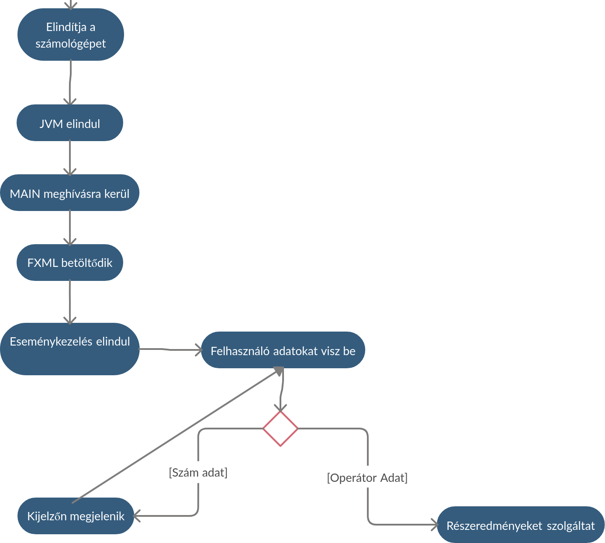

### A rendszer célja

Az alapvető célunk, hogy egységesítsük a magyar matematika oktatást, ennek a Cross-Platform Számológépnek a segítségével. A különböző forrásokból használt számológépekkel a diákokoknak megnehezítheti a dolgát hiszen azt a tanár se feltétlenül ismeri és így nehezebben tudja elmagyarázni milyen funkciót hol tud a számológépben megtalálni. Ezen felül lehet, hogy az ismeretlen forrsából szármozó számológép a megfelelő funkciókat nem is tartalmazza. Ennek kiküszöbölésére szeretnénk létrehozni ezt a megbízható számológépet amit bármilyen platformon nyugodtan használhat, a tanárok is meg tudják tanítani a számológép képességeit egy az erre a célre személyre szabott számológéppel. Nem célunk ezzel, hogy a többi számológépet kitúrjuk, csak, hogy legyen egy egységes számológép az otatás produktivitásának maximalizálásáért.

---

### Projekt terv

1. Projektszerepkörök, felelősségeik
	- a projekt szerepkörökhöz tartozik a kezelő felület kialakítása, a számológép funkcióinak kialakítása
	- a szerepkörök működése a feladat írójának a felelőssége

2. Projektmunkások és felelősségeik
	- a projektmunkások György Dóra, Racs Tamás, Pallagi Ádám
	- felelősek az általuk elvégzett munkajukért

3. Ütemterv
	- a munkára egy hét áll rendelkezésre

4. Mérföldkövek
	- az első feladat a felhasználói felület elkészítése
	- a második feladat a funkciók megírása
	- majd a JUnit tesztek megírása
	

---

### Üzleti folyamatok modellje
1. Üzleti szereplők
   * Oktató
   * Diák
   * Oktatásban illetékes hatóságok
   * Üzleti munkatársak:
        * Rendszergazdák
        * IT osztály tagjai

2. Üzleti folyamatok
    * Tanítás, oktatás
    * Számítások elvégzése
    * Könyvelés
    * Karbantartás
    * Üzemeltetés    
    * Szoftverek elérhetőségének biztosítása a diákok számára

3. Üzleti entitások
    * Operációs rendszerek
    * Internet
    * Intézmény
    * Tárhely
---

### Követelmények

1. Alap műveletek végrehajtása
    - művelet végrehajtásának a menete: operandus megadása -> művelethez szükséges operátor -> újabb operandus -> egyenlő operátor -> az eredmény megjelenik a kijelzőn
    - összetettebb műveletsorok elvégzése is lehetséges, ekkor az egyenlő operátor helyett újabb alap műveletet jelölő operátor jön, majd újabb operandus. A műveletsor végén, ha már nem akarunk újabb műveleteket elvégezni, akkor az egyenlő operátor megnyomásával lezárjuk a műveletsort és megjelenítjük az eredmény.
2. Haladó matekatikai koncepciók végrehajtása
    - művelet végrehajtásának a menete: operandus megadása -> a művelethez szükséges operátor -> az eredmény autómatikusan megjelenik a kijelzőn, anélkül, hogy megnyomnánk az egyenlő operátort.
    - műveletsorok elvégzése közben is használhóek ezek a funkciók.
3. ELőzmény (History) mód használata
    - az elózmények előhívása nagyon egyszerű, a "Hist" gomb megnyomásával egy ablakban láthatóvá válnak az eddigi műveletek és eredményeik
    - az egyes műveletek egymástól jól elkülönítve láthatóak
    - az előzmények között csak azok a műveletek láthatóak, amelyek a program elindítása óta lettek elvégezve, a program bezárásával az előzmények is eltünnek.

--- 

### Funkcionális terv 
A funkcionális specifikációban leírt használati esetek alapján kell ejárnunk.   
Implementációs segítségét a Class Diagram fog nyújtani.    
Néhány demo _activity_ ábra:
1. __Alapvető működés__     

    

2. __Történelem funkció használata:__

   


A matematikai függvényeket, beleértve az alapműveleteket, saját osztályaink alapján fogjuk szolgáltatni.   
A rendszer főbb osztályai:   
* _Calculator_ osztály:
    * Nyomonköveti egy tagváltozóban az aktuális részeredményt
    * Wrapper osztály a StrictMathra nézve
    * A "Controller" osztályban példányosodik
    * Nyomonköveti az aktuálisan alkalmazandó operátort is  
        * Ha nincs mentve jelenleg, akkor mentés kijelzőről + operátor maga
        * Ha van mentve, akkor részkiértékelés
* _MathConstants_ osztály:
    * Statikus osztály, nem példányosítható
    * Statikus függvények révén ad vissza definiált konstans értékeket    
* _HistoryModule_ osztály:
    * Singleton osztály
    * Minden részkiértékelés eredménye rögzítésre kerül ```record(T t)``` metódusa révén
    * Biztosítja a Történelem funkciót
    * Module Interfészből ered
* _Application_ osztály:
    * Lényegében a Main()-t definiáló osztály, _Controller_
    * Itt történik az FXML betöltése     
    * FXML Contoljainak bekötése..     


---

### Fizikai környezet

- Reszponzív megjelenés
- A program Java nyelven legyen írva, a fejlesztéshez és teszteléshez használt felületek, eszközök szabadon választhatóak
- A GUI JavaFX alapokon legyen, a számológép kinézete SceneBuilder használatával legyen összeállítva
- Az Előzmény mód nem igényel adatbázist, ezért nem szükséges annak üzemeltetése sem, az előzmények egy ablakban lesznek megjelenítve
- A program Windows illetve Linux operációs rendszereken egyaránt futtatható és használható 

---

### Architekturális terv

Az architekturálsi tervezési mint alapja az MVC, lesz egy nézet és mögötte a vezérlő üzleti folyamatokkal, a rendszer teljes mértékben bővíthető és különösebb biztonsági funkciói nem lesz, tekintve, hogy egy open source számológép.

---

### Tesztterv

JUnit tesztek készülnek a rendszer meghatározó üzleti folyamataira

---

### Telepítési terv

- Linux operációs rendszeren
```
git clone https://github.com/adampallagi/SZFM_2020_10_RGP.git 
cd SZFM_2020_10_RGP/
mvn package
java -jar ./target/SZFM_2020_10_RGP-1.0.jar
```
- Windows operációs rendszeren:
    - hasonlóan a fenti terminálos futtatáshoz
    - ikon keszítése a programhoz és megnyitása, futtatása azáltal 

---

### Karbantartási terv

- A https://github.com/adampallagi/SZFM_2020_10_RGP GitHub címen mindig a legújabb verzió lesz az elérhető
- Új verzió megjelenése esetén az oktatási intézményt, erről email-ben fogjuk majd értesíteni és majd abban, hogy frissítik-e az alkalmazást vagy nem, szabad akaratuk szerint járnak el 
- A frissítés elvégzése mindig ajánlott, felmerülő problémák, hibák kijavított verziója és/vagy újdonságok lesznek elérhetőek benne.
