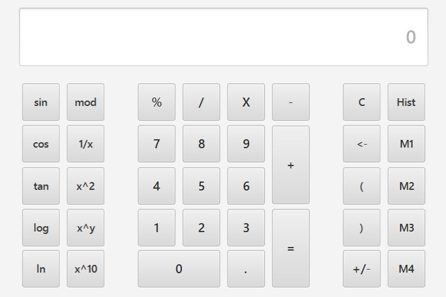

# Funkcionális specifikáció  
### A rendszer céljai és nem céljai.
Az alapvető célunk, hogy egységesítsük a magyar matematika oktatást, ennek a Cross-Platform Számológépnek a segítségével. A különböző forrásokból használt számológépekkel a diákokoknak megnehezítheti a dolgát hiszen azt a tanár se feltétlenül ismeri és így nehezebben tudja elmagyarázni milyen funkciót hol tud a számológépben megtalálni. Ezen felül lehet, hogy az ismeretlen forrsából szármozó számológép a megfelelő funkciókat nem is tartalmazza. Ennek kiküszöbölésére szeretnénk létrehozni ezt a megbízható számológépet amit bármilyen platformon nyugodtan használhat, a tanárok is meg tudják tanítani a számológép képességeit egy az erre a célre személyre szabott számológéppel. Nem célunk ezzel, hogy a többi számológépet kitúrjuk, csak, hogy legyen egy egységes számológép az otatás produktivitásának maximalizálásáért.

---

### Jelenlegi helyzet leírása
Mi egy általános iskolákat összefogó tanári szervezet vagyunk, célunk, hogy a város minden általános iskolása ugyanabban a tanítási minőségben részesüljön, mint bármelyik társa.       
Az iskoláink tanulóinak többsége **Microsoft Windows** felhasználó, így
alapértelmezetten **a gyári számológépet használják** különböző számításai igényeik kielégítésére.      
Észrevettünk azonban egy egyre nagyobb mértékeket öltő tendenciát, a nebulók
elhagyják _szeretett_ Microsoft Windows operációs rendszerünket egy újabb, még általunk is alig ismert, általuk __GNU+Linux__-nak nevezett operációs rendszerekre.       
__Olyan rendszereket használnak, mint például:__   
* Arch Linux
* Gentoo
* Manjaro
* Fedora
* Hannah Montana Linux
* Pop! OS    

De természetesen akadnak még Windows felhasználók is.   
Ezeknél a rendszereknél azt tapasztaltuk, hogy a beépített számológépek nagyon eltérőek egymástól, így egyelőre még Windows-os számológépet ajánljuk használatra és használjuk oktatásra.    

---

### Vágyálom rendszer leírása  
A csoportunk nagyon fontosnak tartja, hogy tanárokként lépést tartsunk a technológiával, hogy a lehető legkorszerűbb eszközöket használjuk az oktatásban, illetve védeni tudjuk diákjainkat az új technológiák jelentette veszélyektől.    
Dedikáltságunkat semmi sem jelzi jobban, mint például **a 80 éves Stefi** bácsi esete, aki a beszterce-lakótelepi általános iskolások testnevelő tanára, aki nemrégiben feltelepítette számítógépére az **Arch Linux** Linux disztribúciót egy úgynevezett ``dwm`` ablakkezelő rendszerrel, hogy naprakész maradjon a fiatalsággal, így jobban tudva motiválni őket a sportolásra.     
Amit mi szeretnék, az a szoftverek egységesítése a különböző platformokra. Nem szeretnénk eltiltani a tanulókat a választás lehetőségétől, a digitális szabadságuk fenntartása az érdekünk, viszont annak érdekében hogy az intézményekben hatékonyan tudjunk tanítani egy-egy programot szeretnénk használni egy-egy konkrét feladatra egységesen.  

Először is szeretnénk rendelni egy olyan számológépet ami nem függ az operációs rendszertől, a számológép támogasson haladó matematikai számításokhoz szükséges funkcionalitást is, pl trigonometria függvények. Az operációs rendszer függetlenségét úgy tudjuk, hogy a Java nyelv támogatja, ezt a technológiát preferálnánk.    
Továbbá, szeretnénk, ha a számológép támogatna egyfajta __"Történelem"__ módot, tehát az elvégzett számításokat szeretnénk eltárolni amíg a program fut.     

---

### Jelenlegi üzleti folyamatok modellje
1. Windows számológép használata
	- Diák betölti a Windows NT Kernelt => shell => userspace => megnyitja a Számológépet
	- Alapvető támogatott műveleteket használja
2. GNU/Linux számológép használata
	- Diák betölti a Linux kernelt => shell => userspace
	- AKtuálisan elérhető számológépet használja
3. A diák egy Online számológépet használ
	- Nem egységes számológép
	- különböző bonyolultabb matematikai műveletek használata

---

### Igényelt üzleti folyamatok modellje

1. Alap matematikai műveletek támogat
    - Az alapműveletek a numerikus billentyűzet közvetlen közelében vannak
2. Haladó matematikai koncepciókat támogat
    - Konverziók, trigonometriai függvények, hres konstansok ...
    - A funkciók típus szerint vannak csoportosítva, a műveletek könnyebb megtalálása érdekében
3. Támogatja a History (Előzmény) módot
    - Az előzmény módban az egyes műveletek esetében látni lehet a műveletet, a számo(ka)t melye(ke)n a művelet elvégezve lett, illetve a művelet eredményét
    - Átlátható, az egyes műveletek nem folynak össze
---

### Követelménylista

1. Könnyen űzemeltethető
2. Reszponzív GUI
3. Java
4. Cross-Platform
5. History (Előzmény) mód [Experiment]
6. Matematikai alapműveletek
7. Matematikai haladó műveletek

---

### Használati esetek [Use cases]
1. __Title:__  A tanuló számítást végez és eredményt kap
   __Main Success Scenario:__ 
    1. A tanuló futtatja a programot (JVM elindul előtte :)).
    2. A program betölti a JavaFX keretrendszert.
    3. A program betölti classpath útján a GUI-t leíró FXML fájt.
    4. A user beírja a kiszámítandó kifejezést.
    5. A számológép részeredményekkel szolgál minden operátor használat esetén.
    6. A felhasználó az '=' gombra kattinva elindítja a végső kiértékelést
    7. A számológép a végső ereményt szolgáltatja.               

    __Extensions:__   
    1a. Nem létezik az FXML fájl    
   * A rendzser összeomlik. "Keresse fel valamelyik rendszergazdát!"  

   1b. A konfigurációs fájl létezik, de sikertelen a parse-olása
   * Ekvivalens 1.a kezelésével
   1c. Értelmezhetetlen matematikai művelet akar elvégezni a user
   * Pl: 0-val osztás esetén dobjon hibát 

   4a/5a.: __[UNDECIDED]__ A user egy kifejezést gépel be
   * Az operátorok nem eredményeznek részkiértékelést
   * Kiértékelési szabályokat követve kifejezés fa épül
   * '='-ra kattinva kiértékelődik a szintaktikailag helyes kifejezés
   * Ellenben, hibát dob a rendszer

2. __Title:__  A tanuló megtekinti eddigi számításait  
   __Main Success Scenario:__     
   1. Kiválasztja a Történelem funckiót.
   2. Felnyílik egy ablak, ahol egy listboxban, esztétikusan, fel vannak sorolva a számítások, követve a számítási szintaxist.
   3. Ha akarja, vágolapra másolja a számítást.
   4. Ha akarja, törli az előzményeket.
   5. Ha akarja, lemezre viszi az aktuális történelmét JSON formátumban

   __Extensions:__   
   1a-5a. Bármilyen hiba esetén azonnal megsemmisíti önmagát(processzus) maga után hagyva a log fájlt a host adminisztárotai számára.   

3. __Title:__ A tanuló a számítási módot vált    
   __Main Success Scenario:__      
   1. A _kijelző_ alatti területen elhelyezkedő rádiógombokra kattint.
   2. A választott rádiógomb alapján választ [Deg/Grad] módok között.
   3. A választás alapján a rendszer automatikus átkonvertálja a jelenleg begépelt értéket.

4. __Title:__ A tanuló elmenti memóriába az aktuális értéket        
   __Main Success Scenario:__       
   1. A tanuló elvégzett számítást.
   2. Az értéket a rendszer kijelzi a _kijelzőn_.
   3. A tanuló a "mod" + memóriagombok egyikére kattint
   4. A rendszer elmenti a megfelelő slotba az értéket

   __Extensions__:    
   1a. Begépel egy értéket   

5. __Title:__ A tanuló lekér egy mentett értéket     
   __Main Success Scenario:__      
   1. A tanuló a memóriagombok egyikére kattint
   2. A mentett érték bekerül egy rendszerváltozóba
   3. A rendszer megjeleníti az értéket a _kijelzőn_

   __Extension:__    
   2a. Amennyiben nincs mentett érték semmi nem történik.   

6. __Title:__ A tanuló lekér egy konstanst   
   __Main Success Scenario:__    
   1. A tanuló az kurzort a menüre viszi
   2. Megnyílik az adott menüelem alatt az opciók
   3. Választ egy konstanst
   4. A rendszer megjelenítani a _kijelzőn_ konstans nevével

   __Extensions:__  
   4a. Neve helyett értékét jeleníti meg.   
   4b. Ha konstans nem egész akkor adott pontosság mellett jeleníti meg a _kijelzőn_.

---

### Megfeleltetés, hogyan fedik le a használati esetek a követelményeket

---

### Képernyő tervek

### Forgatókönyvek

---

### Funkció–követelmény megfeleltetés

---

### Fogalomszótár
Fogalmak:
* **Linux**: Avagy Linux-rendszermag, rendszermag.  
* **Rendszermag**: Az operációs rendszer erőforrásait kezelő program.
* **Linux disztribúció**: A Linux-disztribúciók a Linux-kernelre épülő terjesztések. Linux kernel mellett több-kevesebb szabad szoftvert és kereskedelmi szoftvert tartalmazhatnak.  
* **GNU/Linux, GNU+Linux, ...**: Linux nem egy operációs rendszer magában, inkább egy újabb szabad komponense a teljesen fukcionáló GNU rendszernek, amelyeket a GNU corelibs, shell eszközök és létfontosságú rendszerkomponensek műküödtetnek egy teljes OS-ként, POSIX-meghatározás szerint.
* **GUI (Graphic User Interface)**: A felület amit a felhasználó lát és ahol a program funkcióit használja
* **Előzmény (History) mód**: A korábban elvégzett műveletek listája.
* **Cross-Platform**: Másnéven platformfüggetlenség, mely olyan operációs rendszerekre, programozási nyelvekre vagy számítógépes programokra, szoftverekre és implementációikra vonatkozik, amelyek több számítógépes platformon képesek mülködni. 
* **Platform**: Olyan hardver- és/vagy szoftverkörnyezet, mely meghatározza, hogy az adott számítógépen milyen más programok használhatók.
