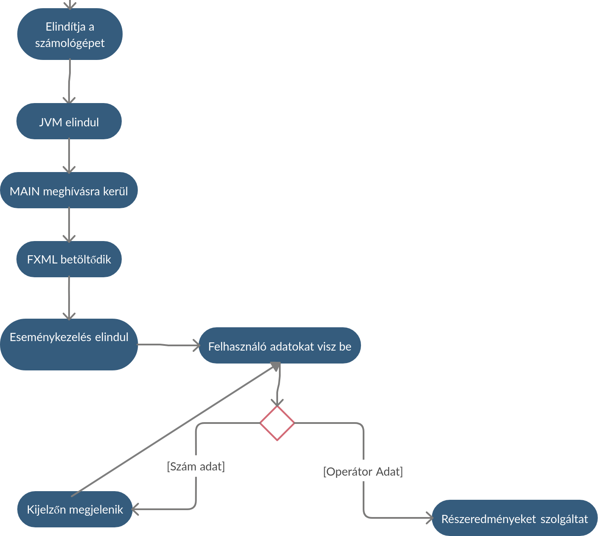
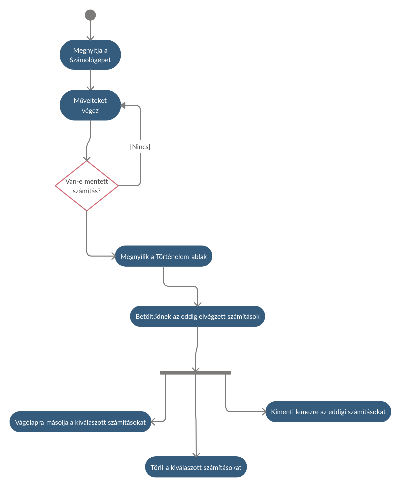

### A rendszer célja

---

### Projekt terv

---

### Üzleti folyamatok modellje
1. Üzleti szereplők
   * Oktató
   * Diák
   * Oktatásban illetékes hatóságok
   * Üzleti munkatársak:
        * Rendszergazdák
        * IT osztály tagjai

2. Üzleti folyamatok
    * Tanítás, oktatás
    * Számítások elvégzése
    * Könyvelés
    * Karbantartás
    * Üzemeltetés    
    * Szoftverek elérhetőségének biztosítása a diákok számára

3. Üzleti entitások
    * Operációs rendszerek
    * Internet
    * Intézmény
    * Tárhely
---

### Követelmények

--- 

### Funkcionális terv 
A funkcionális specifikációban leírt használati esetek alapján kell ejárnunk.   
Implementációs segítségét a Class Diagram fog nyújtani.    
Néhány demo _activity_ ábra:
1. __Alapvető működés__     

    

2. __Történelem funkció használata:__

   


A matematikai függvényeket, beleértve az alapműveleteket, saját osztályaink alapján fogjuk szolgáltatni.   
A rendszer főbb osztályai:   
* _Calculator_ osztály:
    * Nyomonköveti egy tagváltozóban az aktuális részeredményt
    * Wrapper osztály a StrictMathra nézve
    * A "Controller" osztályban példányosodik
    * Nyomonköveti az aktuálisan alkalmazandó operátort is  
        * Ha nincs mentve jelenleg, akkor mentés kijelzőről + operátor maga
        * Ha van mentve, akkor részkiértékelés
* _MathConstants_ osztály:
    * Statikus osztály, nem példányosítható
    * Statikus függvények révén ad vissza definiált konstans értékeket    
* _HistoryModule_ osztály:
    * Singleton osztály
    * Minden részkiértékelés eredménye rögzítésre kerül ```record(T t)``` metódusa révén
    * Biztosítja a Történelem funkciót
    * Module Interfészből ered
* _Application_ osztály:
    * Lényegében a Main()-t definiáló osztály, _Controller_
    * Itt történik az FXML betöltése    
    * FXML Contoljainak bekötése..
---

### Fizikai környezet


---

### Architekturális terv

---

### Tesztterv

---

### Telepítési terv

---

### Karbantartási terv